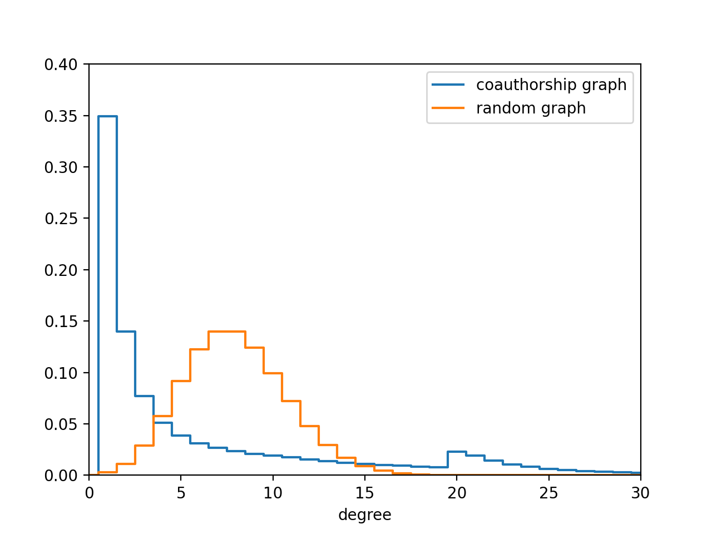

# Co-authorship Network of Google Scholar
I investigated the properties of a co-authorship network of Google Scholar. The nodes of this network are Google Scholar profiles. Two nodes are linked if at least 
one of the authors has specified the other as their co-author. Furthermore, I am focusing only on one connected component that contains 
[Paul Erdos](https://scholar.google.com/citations?user=cVeVZ1YAAAAJ&hl=en) in it. So, we 
are dealing with an unweighted undirected connected graph. The list of co-authors for a given author is located at the right-bottom side of their Google Scholar 
profile page. So, it is possible for two authors to be co-authors in real life but don't list each other as co-authors. For example, 
[Terence Tao](https://scholar.google.com/citations?user=TFx_gLQAAAAJ&hl=en&oi=ao) has zero
co-authors. But he is listed as a co-author of [Emmanuel Candes](https://scholar.google.com/citations?user=nRQi4O8AAAAJ&hl=en&oi=sra), so he is not 
an isolated node and he belongs to the connected component I focus on.  

### Basic properties of the network
Number of nodes: 969,559  
Number of edges: 3,873,577  
Maximal Erdos number (the maximal distance from Paul Erdos to some other node): 11

### Properties connected to the spectrum of the graph
In this section, I focus on the spectrum of the [normalized Laplacian matrix](https://en.wikipedia.org/wiki/Laplacian_matrix#Symmetric_normalized_Laplacian) of the graph. I used Eigen and Spectra packages to compute the eigenvalues and the eigenvectors.  
It is known that all eigenvalues of the normalized Laplacian matrix of a graph are non-negative and there is a zero eigenvalue that corresponds to (sqrt(d1), sqrt(d2), ... sqrt(dn)) eigenvector, where di are the degrees of the vertices. If the graph is connected (which is our case), all other eigenvalues are positive. Unfortunately, computing all the eigenvalues of a given matrix NxN costs 
N3 operations, which is far too long in our case, so I only compute the spectral gap of the graph, which is the difference between the first and the 
second eigenvalues (equals to the second eigenvalue itself since the first one is zero). The first and the second computed eigenvalues are 1.6e-15 and 0.00878701452518. The first value is meant to be exactly zero, but it differs a bit due to a numerical error. So the spectral gap equals to 0.00878701452518.  
Next, I try to estimate the Cheeger constant h, which measures the 'bottleneckedness' of the graph (defined, for example, [here](https://orion.math.iastate.edu/butler/PDF/spectra_lecture_3.pdf)). In our case, a small Cheeger constant would mean the 
presence of two large poorly connected communities. Determining the Cheeger constant exactly is an NP-hard problem, so perhaps no one will ever find the exact value of the Cheeger constant for the Google Scholar co-authorship graph. But we can set some boundaries for h. First, using Cheeger's inequality  
  
we have 0.00439 < h < 0.133.  
Next, I try to set a better upper limit for h by getting a decently sparse cut of the graph. I use spectral partitioning (described, for example, [here](https://people.orie.cornell.edu/dpw/orie6334/Fall2016/lecture7.pdf)) since I already have the second eigenvector of the normalized Laplacian matrix. The least conductance found with spectral partitioning is 0.02703, so h < 0.02703. This corresponds to a small community of 37 people which has only one edge connecting them to the rest of the graph. This upper estimate is stronger than what we had with Cheeger inequality, so the final estimation is 0.00439 < h < 0.027.

### The degree distribution of the graph

This is the plot of the probability of finding a vertex of a given degree for the GS coauthorship graph and Erdos-Renyi random graph with the same number of vertices and edges. As one can see, the GS coauthorship graph has a huge amount of leaves, in fact, 35% of all profiles (in the connected component I am focusing on). There is also an increase in the density of vertices at degree 20, which I can't explain.
